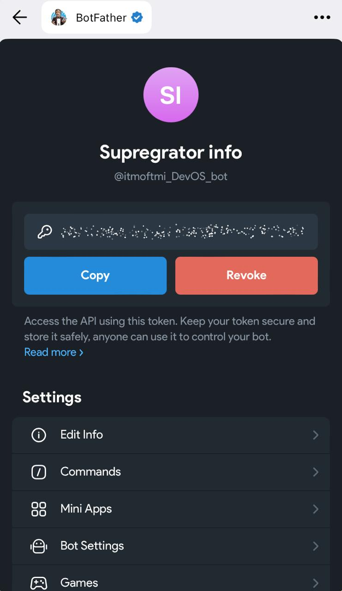
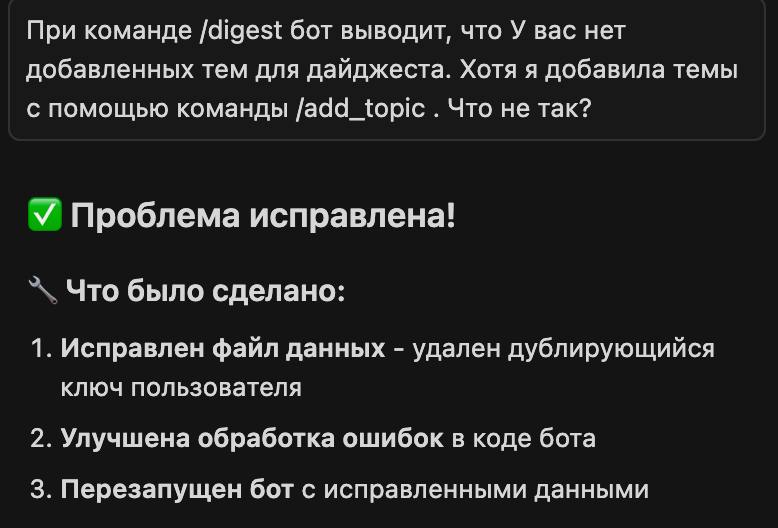

University: [ITMO University](https://itmo.ru/ru/)
Faculty: [FICT](https://fict.itmo.ru)
Course: [Vibe Coding: AI-боты для бизнеса](https://) ADD link
Year: 2025/2026
Group: U4125
Author: Deviatilova Olga
Lab: Lab1
Date of create: 22.10.2025
Date of finished: 23.10.2025

# "Создание первого Telegram-бота без программирования"

Ссылка на видео с функционалом бота: [ссылка](https://drive.google.com/file/d/15WVbYXnXbuRPaFagLEBohCt_1KBYmwvu/view?usp=share_link)

## 1. Выбрала бота: 4. Бот-агрегатор информации

Собирает новости по определенным темам
Отправляет ежедневные дайджесты
Фильтрует информацию по ключевым словам
Сохраняет интересные материалы

## 2. Создала бота в Telegram

## 3. Составила промпт для LLM:

Создай Telegram-бота на Python с использованием библиотеки python-telegram-bot.

Функционал бота:
- Собирает новости по определенным темам
- Отправляет ежедневные дайджесты
- Фильтрует информацию по ключевым словам
- Сохраняет интересные материалы

Требования:
- Бот должен быть простым и понятным
- Код должен быть хорошо прокомментирован
- Использовать файл для хранения данных (JSON)
- Добавить обработку ошибок

Создай:

1. Файл bot.py с кодом бота
2. Файл requirements.txt с зависимостями
3. Файл README.md с инструкцией по запуску
4. Файл .env.example для примера конфигурации

## 4. Генерация кода

Сгенерировала код в LLM, вставила токены, установила зависимости и запустила бота через LLM. 

## 5. Тестирование

Протестировала все функции, они работают

## 6. Ошибки

Была ошибка с тем, что бот не запоминал темы, написала в LLM промт:
При команде /digest бот выводит, что У вас нет добавленных тем для дайджеста. Хотя я добавила темы с помощью команды /add_topic . Что не так?

Проблема решилась, все работает.

Файл с кодом бота добавлен в папку проекта.
