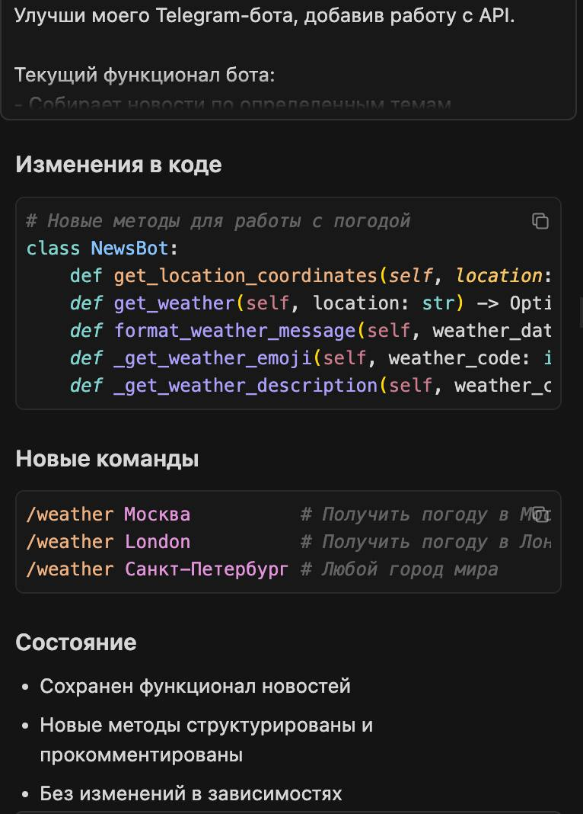
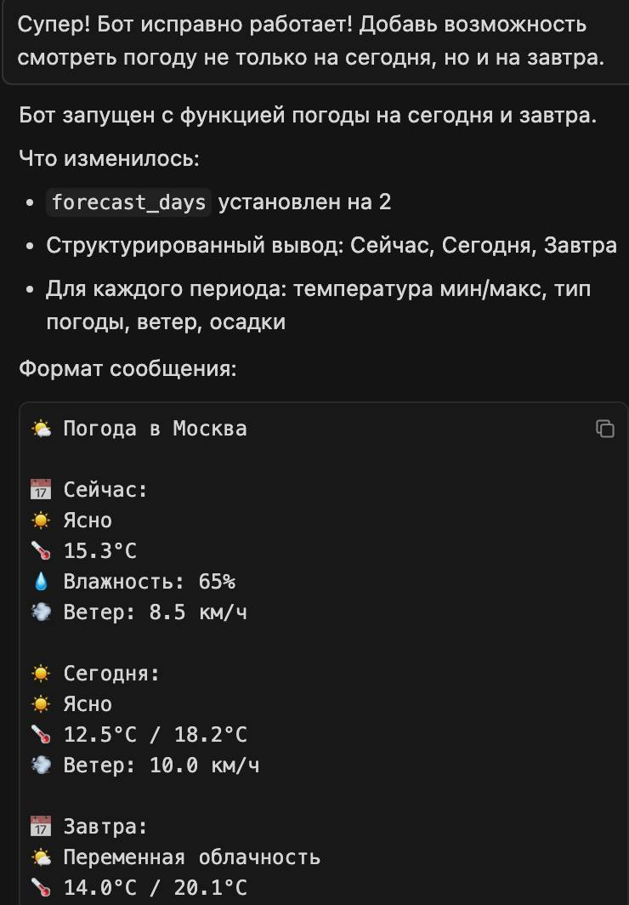

University: [ITMO University](https://itmo.ru/ru/)
Faculty: [FICT](https://fict.itmo.ru)
Course: [Vibe Coding: AI-боты для бизнеса](https://) ADD link
Year: 2025/2026
Group: U4125
Author: Deviatilova Olga
Lab: Lab1
Date of create: 26.10.2025
Date of finished: 27.10.2025

# "Подключение бота к данным"

Ссылка на видео с функционалом бота: [ссылка](https://drive.google.com/file/d/14W0DZhWOG4gJq9COWq6IKRoSjtPxET7g/view?usp=share_link)

Изначально выбрала бота агрегатора новостной информации, поэтому с API познакомилась еще в рамках Лабораторной работы №1.
В этой лабораторной сочла необходимым добавить к новостному дайджесту возможность бота показывать прогноз погоды.

## 1. Составление промпта для LLM

Улучши моего Telegram-бота, добавив работу с API.

Текущий функционал бота:
- Собирает новости по определенным темам
- Отправляет ежедневные дайджесты
- Фильтрует информацию по ключевым словам
- Сохраняет интересные материалы

Новый функционал:
- Подключение к бесплатному API 
- Получение актуальных данных 
- Форматирование и отображение

Данные:
@https://open-meteo.com 

Требования:
- Код должен быть простым и понятным
- Добавить обработку ошибок
- Хорошие комментарии в коде
- Сохранить существующий функционал

Создай:

1. Обновленный bot.py
2. Обновленный README.md

## 2. Генерация кода

Код сгенерирован, запущен бот.
В процессе тестирования поняла, что надо бы добавить погоду на сегодня и завтра.
Обратилась к Cursoru за помощью:

## 3. Тестирование

Протестировала функции, по погоде все работает, но обнаружила, что в дайджесте идет поиск только первой темы, скорректировала код (корректировал Cursor)
После проверила тг бота, все работает.
Записала демо-видео, ссылка приложена в начале лабораторной работы.
