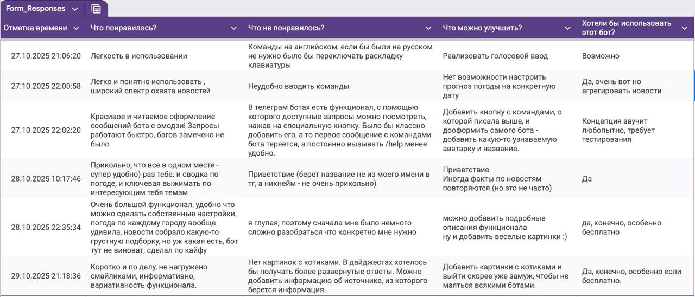

University: [ITMO University](https://itmo.ru/ru/)
Faculty: [FICT](https://fict.itmo.ru)
Course: [Vibe Coding: AI-боты для бизнеса](https://) ADD link
Year: 2025/2026
Group: U4125
Author: Deviatilova Olga
Lab: Lab1
Date of create: 26.10.2025
Date of finished: 31.10.2025

# Запуск бота для реального использования

## 1. Выбор способа деплоя

Выбрала второй (рекомендованный) способ через Облачный хостинг Render, так как Railway предлагал только платные варианты.

## 2. Деплой тг бота

Создала на GitHub новый [репозиторий](https://github.com/helga1206/telegram-news-bot.git) для деплоя бота

Затем зарегистрировалась на Rendere, делала все по инструкции Cursora, который подготовил все необходимые файлы, добавил их в репозиторрий GitHub, установил нужные зависимости. 

Потом создала Web Service по инструкции Cursora с необходимыми командами и параметрами.

Затем задеплоила бота, проверила, что он работает.

## 3. Тестирование и сбор отзывов

После создала гуглформу и направила своим друзьям для тестирования.

Здесь скрин, что они заходили и что-то тыкали, но появлялась ошибка, что бот запущен где-то еще (не критично, бот все равно работал корректно)

После собрала отзывы об использовании тг бота

По результатам опроса нашла несколько важных моментов для исправления:
- поменяла обращение к пользователю в приветствии (раньше был ник, теперь имя пользователя)
- добавила меню команд, чтобы при наборе можно было на них ориентироваться
- также убрала бесючий баг с двойным запуском бота (точнее редактировал все Cursor, а я направляла)

## 4. Final вариант

Итоговую работу бота можно посмотреть по [ссылке](https://drive.google.com/file/d/1mlzLZLJ7fx0B7ygtXH2N-8enTGrPiP3h/view?usp=share_link)

Второго опроса пользователей не проводила, но они заходили, все работает исправно, стало удобнее.
